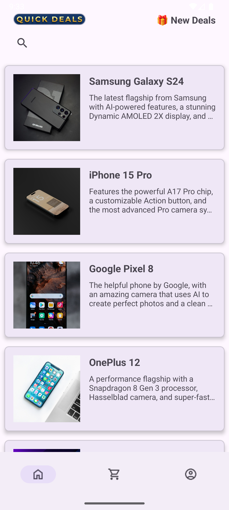
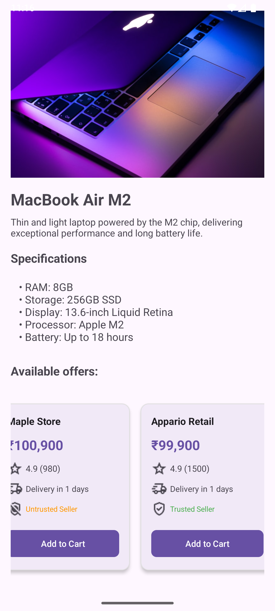
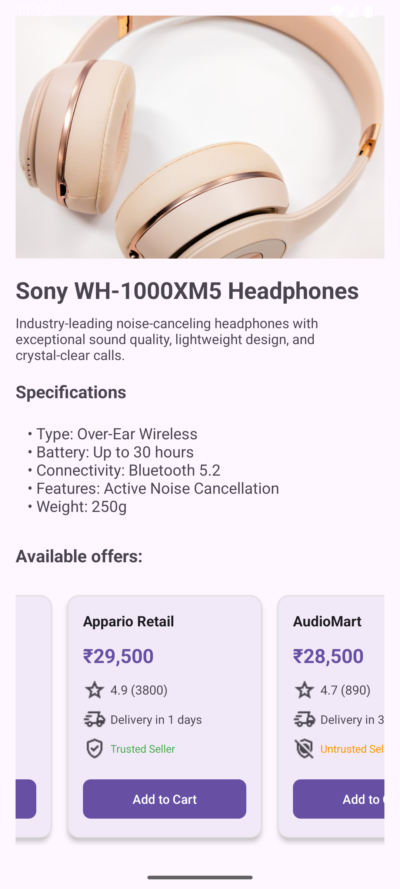
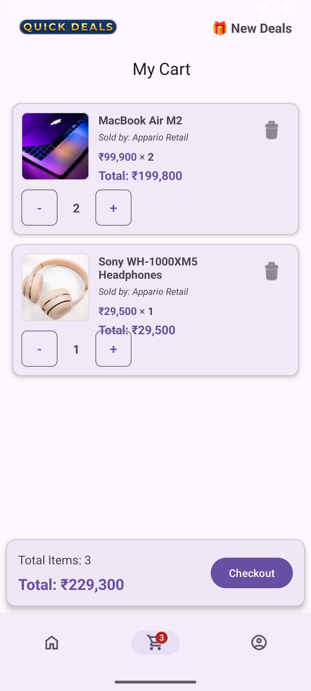
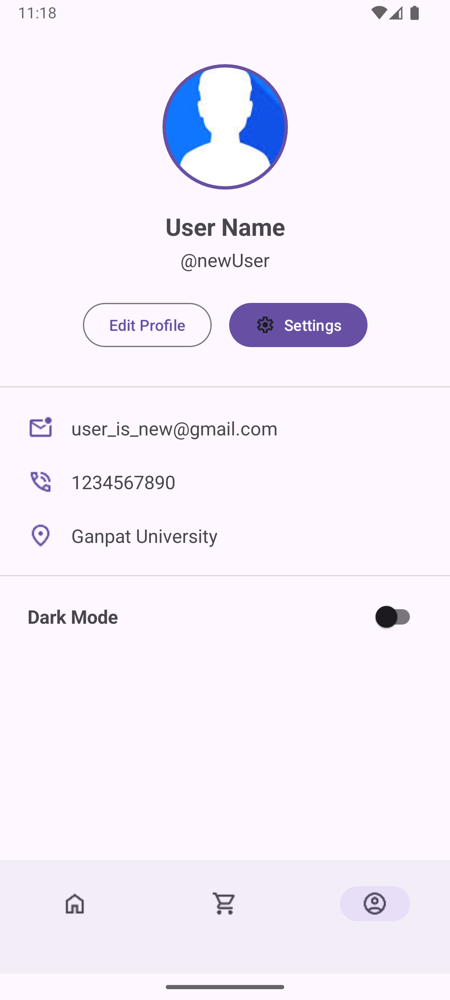

# 🛒 E-Commerce Android App

A modern, feature-rich e-commerce Android application built with Kotlin, featuring product browsing, variant selection, shopping cart, and user profiles.


---

## 📱 Features

### User Authentication
- ✅ User login with email validation
- ✅ User registration with comprehensive field validation
- ✅ Input validation for email, password, phone, and address

### Product Browsing
- ✅ Browse 30+ products across multiple categories
- ✅ Real-time product search by name, brand, and description
- ✅ Product images loaded with Glide
- ✅ Clean, card-based UI design

### Product Details
- ✅ Detailed product information and descriptions
- ✅ Dynamic variant selection (RAM, Storage, Color, Configuration)
- ✅ Multiple seller offers with ratings and delivery information
- ✅ Trusted/Untrusted seller badges
- ✅ Horizontal scrolling offer cards

### Shopping Cart
- ✅ Add products from specific sellers to cart
- ✅ Quantity management (increment/decrement)
- ✅ Real-time cart total calculation
- ✅ Remove items from cart
- ✅ Duplicate prevention - updates quantity if item exists
- ✅ Cart summary with total items and price

### User Profile
- ✅ User profile display with contact information
- ✅ Edit profile and settings buttons (UI ready)

### Navigation
- ✅ Bottom navigation bar (Home, Cart, Profile)
- ✅ Smooth navigation between screens
- ✅ Proper activity lifecycle management

---

## 🏗️ Architecture

### Design Pattern
- **MVVM-lite** architecture
- Singleton pattern for cart management
- RecyclerView with ListAdapter and DiffUtil for efficient list rendering

### Technology Stack
- **Language:** Kotlin
- **UI:** Material Design 3 Components
- **View Binding:** Android ViewBinding
- **Image Loading:** Glide
- **JSON Parsing:** Gson
- **Data Storage:** In-memory (Cart singleton)

### Project Structure
```
com.example.ecommerce/
├── adapter/
│   ├── CartAdapter.kt          # Shopping cart RecyclerView adapter
│   ├── OfferAdapter.kt         # Seller offers adapter
│   └── ProductAdapter.kt       # Product list adapter
├── model/
│   ├── Cart.kt                 # Cart singleton manager
│   ├── CartItem.kt             # Cart item data class
│   └── Product.kt              # Product, Variant, Offer models
├── CartActivity.kt             # Shopping cart screen
├── HomeActivity.kt             # Product listing screen
├── MainActivity.kt             # Login screen
├── ProductDetailActivity.kt   # Product detail screen
├── ProfileActivity.kt         # User profile screen
└── Register.kt                # Registration screen
```

---

## 📸 Screenshots

<p align="center">
  
  
  
  
</p>

<p align="center">
  
  
  
</p>

### Key Features Showcase

**🏠 Home Screen**
- Product grid with search functionality
- Bottom navigation bar
- Clean card-based UI

**📦 Product Pages**
- Browse products with images and pricing
- Detailed product view with variant selection
- Multiple seller offers with ratings and delivery info

**🛒 Shopping Cart**
- Item management with quantity controls
- Real-time price calculation
- Remove items option

**👤 User Profile & Authentication**
- Secure login and registration
- User information display
- Settings and edit profile access

---

## 🚀 Getting Started

### Prerequisites
- Android Studio Arctic Fox or later
- Minimum SDK: 24 (Android 7.0)
- Target SDK: 34 (Android 14)
- Kotlin 1.9+

### Installation

1. **Clone the repository**
   ```bash
   git clone https://github.com/UjjWal557/ecommerce-android-app.git
   cd ecommerce-android-app
   ```

2. **Open in Android Studio**
   - Open Android Studio
   - Select "Open an Existing Project"
   - Navigate to the cloned directory

3. **Sync Gradle**
   - Android Studio will automatically sync Gradle
   - Wait for dependencies to download

4. **Add Required Drawables**
   - Ensure these drawable resources exist in `res/drawable/`:
     - `ic_home`, `ic_cart`, `ic_profile`
     - `ic_star`, `ic_delivery`, `ic_trusted`, `ic_untrusted`
     - `ic_placeholder`, `ic_error`
     - `ic_email`, `ic_phone`, `ic_location`, `ic_settings`
     - `top_logo`, `registration`, `user`
     - `gradient_button.xml`

5. **Add products.json**
   - Place `products.json` in `app/src/main/assets/`
   - Sample products are included

6. **Run the app**
   - Connect an Android device or start an emulator
   - Click "Run" or press Shift+F10

---

## 📦 Dependencies

Add these to your `build.gradle` (Module: app):

```gradle
dependencies {
    // Core Android
    implementation 'androidx.core:core-ktx:1.12.0'
    implementation 'androidx.appcompat:appcompat:1.6.1'
    implementation 'androidx.constraintlayout:constraintlayout:2.1.4'
    
    // Material Design
    implementation 'com.google.android.material:material:1.11.0'
    
    // RecyclerView
    implementation 'androidx.recyclerview:recyclerview:1.3.2'
    
    // Glide for image loading
    implementation 'com.github.bumptech.glide:glide:4.16.0'
    annotationProcessor 'com.github.bumptech.glide:compiler:4.16.0'
    
    // Gson for JSON parsing
    implementation 'com.google.code.gson:gson:2.10.1'
}
```

---

## 🎯 Usage

### For Users

1. **Login/Register**
   - Launch app → Enter email and password → Login
   - Or click "Sign Up" to create a new account

2. **Browse Products**
   - View products on home screen
   - Use search bar to find specific products
   - Tap product card to view details

3. **Select Variants**
   - Choose configuration (RAM/Storage/Color)
   - View offers from different sellers
   - Compare prices and delivery times

4. **Add to Cart**
   - Tap "Add to Cart" on desired seller offer
   - View cart via bottom navigation
   - Adjust quantities with +/- buttons

5. **Checkout**
   - Review cart items and total
   - Tap "Checkout" button (feature in progress)

### For Developers


#### Customizing UI
- **Colors:** `res/values/colors.xml`
- **Strings:** `res/values/strings.xml`
- **Dimensions:** `res/values/dimens.xml`
- **Themes:** `res/values/themes.xml`

---

## 🔧 Configuration

### Cart Management
The cart uses a singleton pattern for in-memory storage:
```kotlin
// Add item to cart
Cart.addItem(cartItem)

// Get cart items
val items = Cart.getCartItems()

// Get totals
val totalItems = Cart.getTotalItemCount()
val totalPrice = Cart.getTotalPrice()

// Clear cart
Cart.clear()
```

### Image Loading
Glide configuration in adapters:
```kotlin
Glide.with(context)
    .load(imageUrl)
    .placeholder(R.drawable.ic_placeholder)
    .error(R.drawable.ic_error)
    .into(imageView)
```

---

## ✅ Testing

### Manual Testing Checklist

#### Authentication
- [ ] Login with valid email/password
- [ ] Login with invalid email shows error
- [ ] Login with short password shows error
- [ ] Registration validates all fields
- [ ] Registration with invalid phone shows error

#### Product Browsing
- [ ] Products load on home screen
- [ ] Search filters products correctly
- [ ] Product cards are clickable
- [ ] Images load properly

#### Product Details
- [ ] Product details display correctly
- [ ] Variant selection shows appropriate offers
- [ ] Add to cart works
- [ ] Adding duplicate item updates quantity

#### Shopping Cart
- [ ] Cart displays items correctly
- [ ] Quantity increment/decrement works
- [ ] Remove item works
- [ ] Cart total calculates correctly
- [ ] Empty cart shows appropriate message

#### Navigation
- [ ] Bottom navigation switches screens
- [ ] Back button works correctly
- [ ] No activity stack buildup

---

## 🐛 Known Issues

- ⚠️ Cart data is lost when app is closed (no persistence yet)
- ⚠️ Checkout functionality not implemented
- ⚠️ User authentication is simulated (no backend)
- ⚠️ Profile edit functionality shows "coming soon"

---

## 🚧 Roadmap

### Version 2.0 (Planned)
- [ ] Firebase Authentication integration
- [ ] Room Database for cart persistence
- [ ] Order history
- [ ] Checkout and payment integration
- [ ] Push notifications
- [ ] Wishlist feature

### Version 2.1 (Future)
- [ ] Product reviews and ratings
- [ ] Advanced filters and sorting
- [ ] User addresses management
- [ ] Order tracking
- [ ] Dark mode support

---

## 🤝 Contributing

Contributions are welcome! Please follow these steps:

1. Fork the repository
2. Create a feature branch (`git checkout -b feature/AmazingFeature`)
3. Commit your changes (`git commit -m 'Add some AmazingFeature'`)
4. Push to the branch (`git push origin feature/AmazingFeature`)
5. Open a Pull Request

### Code Style
- Follow Kotlin coding conventions
- Use meaningful variable names
- Add comments for complex logic
- Keep functions small and focused

---

## 📄 License

This project is licensed under the MIT License - see the [LICENSE](LICENSE) file for details.

---

## 👥 Authors

- **Ujjwal Roy** - *Initial work* - [UjjWal557](https://github.com/UjjWal557)

---

## 🙏 Acknowledgments

- Material Design 3 for UI components
- Unsplash for product images
- Google for Android development tools
- Glide library for efficient image loading

---

## 📞 Support

For support, email ujjwal777roy@gmail.com or open an issue in the repository.

---

## 📊 Project Stats

- **Total Lines of Code:** ~3,000+
- **Number of Activities:** 6
- **Number of Adapters:** 3
- **Number of Models:** 4
- **Supported Products:** 30+
- **Minimum Android Version:** 7.0 (API 24)
- **Target Android Version:** 14 (API 34)

---

<div align="center">

**Made with ❤️ and Kotlin**

⭐ Star this repository if you find it helpful!

[Report Bug](https://github.com/UjjWal557/ecommerce-android-app/issues) · [Request Feature](https://github.com/UjjWal557/ecommerce-android-app/issues)

</div>
